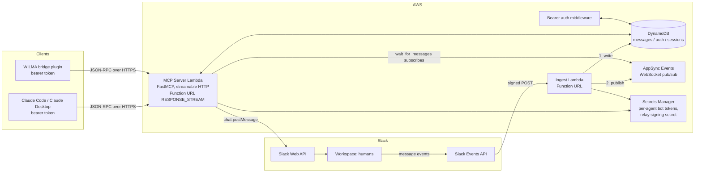

# Slack MCP Server: Design Document

A self-hosted MCP server that lets LLM agents (Claude Code, Claude Desktop, WILMA, and
other MCP clients) send and receive Slack messages in your own workspace. Real-time delivery when an agent
session is active, durable store-and-forward when it is not. Built on AWS, deployed with
CDK, and structured as a portfolio piece: every layer uses the native mechanism for its
trust boundary and is independently demoable.

## 1. Goals

- Anyone can deploy their own instance into their own Slack workspace; the deployment
  is the tenancy boundary and each instance is operated by its owner.
- Token holders point an MCP client at the server and send messages into Slack
  (channels the bots are invited to, or DMs by user ID).
- Replies in Slack reach the agent instantly while it holds an active session, and are
  stored in DynamoDB for pickup when it does not.
- Works for any MCP client that can send a bearer header (Claude Code, Claude
  Desktop, the WILMA CLI), including small local models (8B class).
- Multiple agents can converse with each other through Slack threads, with server-side
  loop guardrails and full human observability.
- Infrastructure as code (CDK, Python), audit logging, least-privilege IAM.

### Non-goals (for now)

- Multi-tenant service with an OAuth 2.1 authorization server. Considered and dropped
  (July 2026): the single-tenant self-hosted model covers the actual need, and each
  deployment's static bearer tokens are its access control. Consequence: claude.ai
  custom connectors (which require OAuth with dynamic client registration) are not
  supported clients; Claude Code, Claude Desktop, and headless clients are.
- Per-user Slack identities (messages post as agent bots, not as humans). Documented as
  a phase 2 option.
- Multi-workspace support. One Slack workspace, one bot app.
- Slack Marketplace distribution. The Slack app is internal to the workspace.

## 2. Architecture



### Components

| Component | AWS resource | Responsibility |
|---|---|---|
| MCP server | Lambda (arm64, Python) + Function URL (`RESPONSE_STREAM`) + Lambda Web Adapter | Streamable HTTP MCP endpoint; tool execution; token validation |
| Auth layer | Middleware in the same Lambda | Bearer token validation (deployment-local tokens from Secrets Manager) |
| Ingest | Lambda + Function URL | Slack Events API receiver: signature check, dedupe, store, publish |
| Message store | DynamoDB | Durable inbox, per-session cursors, threads, audit log |
| Real-time bus | AppSync Events API | Push new messages to active sessions over WebSocket |
| Secrets | Secrets Manager | Per-agent bot tokens (`xoxb-`), relay bot token, relay signing secret |
| IaC | CDK (Python) | Everything above, plus alarms and log retention |

Function URLs are used instead of API Gateway because API Gateway buffers responses and
breaks SSE streaming, which streamable HTTP MCP requires.

### Repository layout

Public repo. CDK structure follows the house conventions established in the JstVerify
repo (Python CDK, `bin/app.py` entrypoint, per-env config JSON, camelCase stack
modules, `deployCDK.sh` wrapper), extended with the hygiene a public portfolio repo
needs: docs, tests, CI, examples, and no committed account-specific configuration.

```
slack-mcp/
  README.md                       # pitch, architecture diagram, quick start, demo GIF
  DESIGN.md                       # this document
  LICENSE                         # MIT
  .gitignore                      # config/{dev,prod}.json, .venv, cdk.out, CLAUDE.md, .claude/
  .github/
    workflows/
      ci.yml                      # ruff + pytest + cdk synth on push/PR
  pyproject.toml                  # ruff + pytest configuration
  requirements.txt                # CDK app dependencies
  cdk.json                        # {"app": "python3 bin/app.py"}
  deployCDK.sh                    # venv bootstrap, env selection, --auto-approve / --deploy-only
  bin/
    app.py                        # CDK entrypoint; loads config/{env}.json via --context env=<env>
  config/
    example.json                  # committed template with placeholder account/region/names
    README.md                     # what each field means
    (dev.json / prod.json)        # real configs, gitignored
  docs/
    architecture.md               # expanded diagrams and flows
    authentication.md             # bearer token model, rotation, threat notes
    slack-app-setup.md            # workspace setup runbook
    slack-manifests/
      relay-app.yml               # relay app manifest (events + read scopes)
      agent-app.yml               # template manifest for a new agent app
    images/                       # diagrams, screenshots, demo GIF
  infrastructure/
    stacks/
      secretsStack.py             # per-agent bot tokens, relay token, signing secret
      dynamoDbStack.py            # messages, sessions, auth tables
      lambdaFunctionStack.py      # MCP server + ingest functions, Function URLs
      appsyncEventsStack.py       # AppSync Events API, namespace, IAM auth
      monitoringStack.py          # alarms (error rate, DLQ depth) to alarm_email
      pipelineStack.py            # optional CodePipeline via CodeStar connection
    lambdaFunctions/
      mcpServer/
        app.py                    # FastMCP app behind Lambda Web Adapter
        tools/                    # one module per MCP tool
        auth/                     # bearer token validation middleware
        requirements.txt
      slackIngest/
        app.py                    # signature check, dedupe, store, publish
        requirements.txt
      sharedModules/
        models.py                 # message / session / identity dataclasses
        dynamo.py                 # table access, cursor logic
        slack.py                  # Slack client factory (token per agent)
        registry.py               # agent registry lookups
  clients/
    wilma-plugin/
      slack_mcp.py                # WILMA bridge plugin (drop into ~/.wilma5_plugins/)
      README.md
    examples/
      claude-code.mcp.json        # .mcp.json snippet for Claude Code
  scripts/
    admin.py                      # rotate tokens, register agents, kill switch
  tests/
    unit/                         # per-module tests (auth, cursors, guardrails, ingest)
    integration/                  # against deployed dev stack (marked, not run in CI)
```

Conventions carried over: resources named `{environment_name}-{project_name}-*`
(e.g. `dev-slackmcp-messages`), secrets named `{Env}-{Project}-BotToken-{agent_id}`,
dev and prod environments in us-east-1 driven entirely by the config JSON, and stack
wiring done in `bin/app.py` with cross-stack references passed as constructor
arguments.

Public-repo deltas from house convention: real `config/{env}.json` files are
**gitignored** (they carry the AWS account id and alarm email; the committed
`example.json` documents the shape), no API keys or secrets of any kind in the repo,
and CI runs `cdk synth` against `example.json` so infrastructure changes are validated
without credentials. A custom domain (e.g. `slack-mcp.dev.justbardtech.com`, matching
the existing `mcp.dev.justbardtech.com` pattern) is optional later; it requires
CloudFront in front of the Function URL since Function URLs do not take custom domains
directly, and CloudFront must pass SSE through (caching disabled, long origin read
timeout).

## 3. Slack identity model: one app per agent

Each agent is its own internal Slack app with its own bot user. Bot users are free (no
seat), have a real name, avatar, and App Home, can be invited to channels, can DM and
be DM'd, are labeled with Slack's APP badge, and critically are **@mention-able**, so a
human can type `@WILMA` to address a specific agent.

The workspace therefore contains N+1 apps:

- **One relay app** (`slack-relay`). The only app that subscribes to the Events API and
  the only one with read/history scopes. It is the server's eyes: it must be a member
  of every channel the system covers.
- **One app per agent** (`WILMA`, `Claude`, ...). Send-only: minimal scopes, no event
  subscriptions. The server picks the right bot token at `send_message` time based on
  the authenticated identity's `agent_id`.

Why a dedicated relay instead of letting every agent app subscribe to events: if N apps
subscribed in the same channel, Slack would deliver every message N times (once per
app, each with a distinct `event_id`), requiring N signing-secret verifications and
content-level dedupe. One relay app means one event stream, one signing secret, one
delivery per message.

### Attribution and routing

- **Echo filtering / sender identification**: inbound bot messages carry the sending
  app's `api_app_id` and `bot_id`; the agent registry (section 5) maps these back to
  `agent_id`. Slack [message metadata](https://docs.slack.dev/messaging/message-metadata)
  (`event_type: "agent_message"`, payload: `agent_id`, `session_id`) is attached to
  every outbound message as a second, session-precise signal.
- **Mentions**: ingest parses `<@bot_user_id>` tokens from message text into a
  `mentions` list of `agent_id`s, so `wait_for_messages` / `check_messages` can filter
  to "messages addressed to me" and a human's `@WILMA ...` routes naturally.
- **Dedupe** is on `(channel, ts)` via a conditional put (the natural table key), with
  `event_id` retained for tracing. This also makes ingest idempotent against Slack's
  up-to-3 delivery retries.

### Required Slack app configuration

- **Relay app**: bot scopes `channels:read`, `channels:history`, `im:history`,
  `users:read`; event subscriptions `message.channels`, `message.im`; request URL =
  ingest Function URL; signing secret stored in Secrets Manager and verified on every
  request (HMAC of timestamp + body, 5-minute timestamp window against replay).
- **Agent apps**: bot scopes `chat:write`, `im:write` only. No event subscriptions, no
  request URL, so no signing secret needed beyond the unused default.
- Both are defined by app manifests committed under `docs/slack-manifests/`, so adding
  an agent is: create app from manifest, install to workspace, store the bot token as
  `{Env}-{Project}-BotToken-{agent_id}`, and register the agent (section 5).
- Every agent app and the relay must be invited to a channel for the system to operate
  in it, which doubles as a human-visible, per-channel opt-in.

## 4. Authentication and authorization

Three trust boundaries, each using its native mechanism. No credential crosses a
boundary it does not belong to.

### 4.1 MCP client to MCP server

Static bearer tokens, local to the deployment. The token lives in Secrets Manager
(`{Env}-{Project}-DevBearerToken`, generated at deploy time), clients send it as
`Authorization: Bearer <token>`, and the middleware compares in constant time.
Distribution is manual and deliberate: the operator hands the token to the clients
they trust, exactly like the Slack tokens themselves.

- Rotation: `put-secret-value` with a new value, then bounce the Lambda (the token is
  cached per container). All clients re-key at once.
- The agent-to-agent milestone extends this to a token-per-agent map (each token
  resolves to an `agent_id`), still static, still Secrets Manager.
- Access is all-or-nothing per token; there are no scopes. A holder can do everything
  the tools allow, so treat the token like the Slack bot tokens.

A full OAuth 2.1 authorization server (DCR, PKCE, consent, hashed short-lived tokens,
PATs) was designed for a multi-tenant version of this system and deliberately dropped
in July 2026: self-hosting made deployment the tenancy boundary, which removes the
need for per-person grants. The main trade-off accepted: claude.ai custom connectors
require OAuth and therefore cannot connect.

### 4.2 MCP server to Slack

One bot token (`xoxb-`) per agent app plus the relay app's token, all in Secrets
Manager, read at cold start, never exposed to clients or logs. The authenticated
identity's `agent_id` selects which token `send_message` uses; read paths use the relay
token. Inbound Slack events are authenticated by signing-secret verification in the
ingest Lambda. If phase 2 adds per-user Slack posting, user tokens (`xoxp-`) are stored
KMS-encrypted per identity.

### 4.3 Inside AWS

IAM roles with least privilege: MCP Lambda may read/write its tables, subscribe to
AppSync Events, and read its secrets; ingest Lambda may write messages, publish events,
and read the signing secret. AppSync Events uses IAM auth; nothing is publicly
subscribable.

## 5. Data model (DynamoDB)

Three tables (could be consolidated to one; kept separate for clarity and independent
TTL/capacity settings). All on-demand capacity.

### `messages`

| Attribute | Example | Notes |
|---|---|---|
| `PK` | `CH#C0123456` | Slack channel |
| `SK` | `TS#1721068800.000100` | Message timestamp (sort order = time) |
| `thread_ts` | `1721068700.000100` | Present for thread replies; GSI for thread reads |
| `sender_type` | `human` / `agent` | From metadata inspection |
| `agent_id` | `wilma` | Only for agent messages |
| `slack_event_id` | `Ev01ABC` | Dedupe key (conditional put) |
| `text`, `user`, `permalink` | | Message content and provenance |
| `ttl` | +30 days | Inbox retention |

### `sessions`

| Attribute | Notes |
|---|---|
| `PK = SESSION#<session_id>` | One item per active agent session |
| `identity`, `agent_id` | Who is connected |
| `cursor_<channel>` | Last-delivered timestamp per channel (multi-consumer: each session tracks its own position; no shared "delivered" flag) |
| `ttl` | Heartbeat + 5 minutes; expiry = offline |

### Auth-related items

With static tokens there is no separate auth table. Two item families join the
`messages` table as milestones land: `USER#<slack_user_id>` (name-resolution cache,
1-day TTL, written by ingest) and, with agent-to-agent, `AGENT#` registry items
(`agent_id`, Slack `api_app_id`, `bot_id`, `bot_user_id`, display name, token secret
name) plus an optional `AUDIT#` append-only send log. The token-to-agent map itself
lives in Secrets Manager, not DynamoDB.

## 6. Message lifecycle

### Outbound (agent to Slack)

1. Agent calls `send_message(channel, text, thread_ts?)`.
2. Server checks per-identity rate limit, channel allowlist, message length cap,
   and thread turn budget (section 8).
3. `chat.postMessage` using the identity's agent app token, with attribution metadata.
4. Message and thread timestamp recorded; audit row appended.

### Inbound (Slack to agents)

1. Slack Events API POSTs to ingest. Verify signature, answer URL-verification
   handshake, dedupe on `event_id`.
2. Write message to `messages` (conditional put). This always happens and is the
   durability guarantee.
3. Publish to AppSync Events channel `slack/messages/{channel_id}`. If nobody is
   subscribed this is a no-op.

### Delivery: agent online

`wait_for_messages(timeout_seconds<=120, channels?)`:

1. Upsert session item (heartbeat, TTL). An unexpired session item = "online".
2. Subscribe to the AppSync Events WebSocket **first**.
3. Then query `messages` past the session cursor. If anything is pending, return it
   immediately (closing the subscribe-first race; duplicates removed by message ts).
4. Otherwise block on the socket until an event arrives or timeout; return arrivals
   (excluding the session's own sends, via metadata `agent_id`).
5. Advance the session cursor. The agent loops on this call to stay "in session".

### Delivery: agent offline

Nothing is subscribed; step 3 of ingest evaporates; the DynamoDB write from step 2
holds the message. The next `check_messages` or `wait_for_messages` drains from the
cursor. Nothing is ever lost because the durable write happens before the publish.

Optional presence touch: ingest can check for a live session and react in-thread so
humans know whether the agent saw the message live or will pick it up later.

## 7. MCP tool surface

Designed to the weakest caller (8B local models): few tools, flat parameters, strings
and integers only, defaults for everything optional, imperative descriptions.

| Tool | Parameters | Notes |
|---|---|---|
| `send_message` | `channel`, `text`, `thread_ts?` | Posts via the caller's own agent app; `channel` may be a user ID for a one-way DM |
| `check_messages` | `channel?`, `limit?` | Drains inbox past session cursor |
| `wait_for_messages` | `timeout_seconds?`, `channel?` | Long-poll; the "session" primitive |
| `read_thread` | `channel`, `thread_ts` | Full thread via the relay |
| `list_channels` | none | Channels the relay is a member of |

Search is deliberately deferred: Slack's search API requires a user token, but the
inbox accumulates history in DynamoDB, so a `search_messages` over the store can come
later without new Slack scopes.

## 8. Agent-to-agent conversation and guardrails

Slack is the message bus; two agents in the same thread converse through the normal
lifecycle above. Humans see everything and can interject; a human message is just
another inbound event delivered to both agents.

Server-side guardrails (not bypassable by prompts):

- **Echo filtering**: a session never receives its own messages (metadata `agent_id` +
  `session_id` match), but does receive other agents' messages.
- **Turn budget**: max N consecutive agent messages per thread (default 6) with no
  human message; further sends return an error telling the agent to wait for a human.
  A human message resets the budget.
- **Rate limits**: per-identity sends per minute; global cap aligned with Slack's
  ~1 msg/sec/channel limit.
- **Cooldown**: minimum seconds between consecutive agent messages in one thread.
- **Kill switch**: operator CLI to rotate a token or disable sends globally.

## 9. WILMA integration

- **Bridge plugin** (`~/.wilma5_plugins/slack_mcp.py`): uses the official `mcp` Python
  SDK; connects over streamable HTTP with `Authorization: Bearer $SLACK_MCP_TOKEN`;
  calls `tools/list`; registers each tool as a `ToolDef` forwarding to
  `session.call_tool()`. Generic: works for any MCP server URL, not just this one.
- **Core note**: WILMA's `compact_context` profiles filter tools to `_BASE_TOOLS` plus
  already-used tools. Either add the Slack tools to `_BASE_TOOLS` in `agent.py` or make
  that set plugin-extendable so small models see the tools on turn 1.
- **Listen mode** (later): a WILMA loop that repeatedly calls `wait_for_messages` and
  feeds arrivals into the ReAct loop, making WILMA an always-on participant.

## 10. Milestones

Each is independently demoable; ordering minimizes rework.

1. **Core server**: FastMCP on Lambda (Function URL, streamable HTTP), `send_message`
   + `list_channels` + `read_thread` against the Slack API, static bearer token as a
   placeholder for auth, CDK stack, connected from Claude Code. Slack side: relay app
   plus the first agent app, from manifests.
2. **Ingest + inbox**: Events API Lambda (signature verification, dedupe), `messages`
   table, `check_messages` with cursors. Demo: reply in Slack, agent reads it.
3. **Sessions + real-time**: AppSync Events, `wait_for_messages`, presence records.
   Demo: live round-trip conversation with a human in Slack.
4. **WILMA bridge**: plugin + `_BASE_TOOLS` change. Demo: Dolphin 3 local model sending
   Slack messages through the same server.
5. **Agent-to-agent**: second agent app, token-per-agent auth map, mention routing,
   echo filtering, turn budgets, cooldowns. Demo: two agents conversing in a thread,
   human interjecting by @mention.
6. **Optional dashboard**: AppSync GraphQL + React live conversation viewer.

(The original milestone 4, an OAuth 2.1 authorization server, was dropped; see
section 4.1.)

## 11. Cost estimate (personal scale)

| Item | Estimate |
|---|---|
| Lambda (incl. long-poll idle at 256 MB) | < $1/mo |
| DynamoDB on-demand | < $1/mo |
| AppSync Events | ~ $1 per million events + $0.08 per million connection-minutes; effectively < $1/mo |
| Secrets Manager | $0.80/mo (2 secrets) |
| CloudWatch logs (retention capped) | < $1/mo |
| **Total** | **~ $3 to 5/mo** |

## 12. Security summary

- Bearer tokens generated by Secrets Manager, rotated by overwrite + Lambda bounce;
  a token grants full tool access, so distribute like a bot token.
- Slack signing secret verification with replay window on every inbound event.
- Bot tokens never leave the server side; least-privilege IAM throughout.
- Channel access is opt-in by invitation; agent-to-agent adds turn budgets, cooldowns,
  and an audit log.
- AppSync Events auth is a server-side API key held only by the Lambdas; Function URLs
  are the only public surface.
- Messages from Slack are untrusted input to the consuming LLM; sessions with humans
  present are the current mitigation, and server-side guardrails land with
  agent-to-agent.

## 13. Open questions

- App naming and avatar set for the workspace.
- Whether phase 2 per-user Slack identities (user OAuth, KMS-encrypted `xoxp-` tokens)
  are worth the token lifecycle cost.
- Dashboard: AppSync GraphQL vs reusing the Events channel from a static page.
