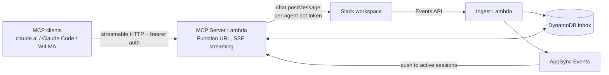

# slack-mcp

A remote MCP (Model Context Protocol) server that lets LLM agents send and receive
Slack messages. Multiple agents, each with its own Slack identity, can post to
channels, read threads, and (in later milestones) hold real-time conversations with
humans and with each other, with Slack as the human-observable message bus.

Runs serverless on AWS: Lambda behind a streaming Function URL (streamable HTTP
transport), DynamoDB for durable message storage, AppSync Events for real-time push.
Infrastructure is defined with AWS CDK (Python).

See [DESIGN.md](DESIGN.md) for the full architecture, threat model, and data design.

## Architecture



Each agent is its own Slack app with a real, @mention-able bot user. A single relay
app is the only event subscriber and reader, so every message is delivered and
verified exactly once regardless of how many agents share a channel.

## Status and roadmap

| Milestone | Scope | Status |
|---|---|---|
| 1. Core server | MCP server on Lambda, send/read tools, CDK, static bearer auth | Done |
| 2. Ingest + inbox | Slack Events API, DynamoDB message store, cursors | Done |
| 3. Sessions + real-time | AppSync Events, `wait_for_messages` long-poll | Done |
| 4. AuthN/AuthZ | OAuth 2.1 (DCR + PKCE), PATs, scopes, audit log | Planned |
| 5. WILMA bridge | MCP client plugin for local/offline models | Planned |
| 6. Agent-to-agent | Mention routing, echo filtering, turn budgets | Planned |

## Quick start

Prerequisites: an AWS account with CDK bootstrapped, Node.js (for the CDK CLI),
Python 3.12, Docker (for Lambda bundling), and a Slack workspace you administer.

1. Create the Slack apps (one relay app, one app per agent) from the manifests in
   `docs/slack-manifests/`. See [docs/slack-app-setup.md](docs/slack-app-setup.md).
2. Copy `config/example.json` to `config/dev.json` and fill in your AWS account id
   and agent list. Real config files are gitignored.
3. Deploy:

   ```bash
   ./deployCDK.sh dev
   ```

4. Store the Slack bot tokens in the created secrets:

   ```bash
   aws secretsmanager put-secret-value \
     --secret-id Dev-SlackMcp-RelayBotToken --secret-string xoxb-...
   aws secretsmanager put-secret-value \
     --secret-id Dev-SlackMcp-BotToken-claude --secret-string xoxb-...
   ```

5. Fetch the generated dev bearer token and connect a client (example for Claude
   Code in `clients/examples/claude-code.mcp.json`):

   ```bash
   aws secretsmanager get-secret-value \
     --secret-id Dev-SlackMcp-DevBearerToken --query SecretString --output text
   ```

The MCP endpoint is the `McpEndpoint` stack output (a Lambda Function URL plus
`/mcp`).

## Local development

```bash
python3 -m venv .venv && source .venv/bin/activate
pip install -r requirements.txt -r requirements-dev.txt

ruff check .
pytest

# Run the MCP server locally (uses DEV_BEARER_TOKEN instead of Secrets Manager)
cd infrastructure/lambdaFunctions/mcpServer
DEV_BEARER_TOKEN=local-token python -m uvicorn app:app --port 8000
```

## Repository layout

```
bin/, config/, infrastructure/   CDK app: entrypoint, per-env config, stacks, Lambda code
docs/                            Runbooks and Slack app manifests
clients/                         Example MCP client configs (WILMA plugin arrives in milestone 5)
tests/unit/                      Unit tests (no AWS or Slack access required)
```

## License

MIT. See [LICENSE](LICENSE).
