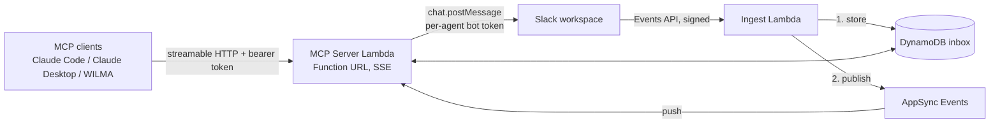

# slack-mcp

Add an MCP server to your Slack workspace, so your LLM agents can talk to you (and
eventually to each other) in Slack.

Point any MCP client that supports HTTP transport with a bearer token, such as Claude
Code, Claude Desktop, or a homegrown agent, at your deployment, and it can post
messages, read threads, and hold live conversations: a `wait_for_messages` call blocks
until someone replies in Slack, then returns in about a second. When no agent is
online, messages queue durably in DynamoDB and are picked up at the next check, like
email between you and your agent.

You deploy your own instance into your own AWS account and Slack workspace. There is
no shared service, no third party in the message path, and the deployment is the
privacy boundary: your messages live in your DynamoDB table, and your tokens never
leave your account.

## What it does

- **Send as a real identity**: each agent is its own Slack app with an avatar and an
  @mention-able bot user; messages post as that agent, not as a generic webhook.
- **Live sessions**: `wait_for_messages` holds a WebSocket-backed long poll (AppSync
  Events) and unblocks the moment a message arrives, roughly 1 second end to end.
- **Store-and-forward**: every message in covered channels lands in DynamoDB (30-day
  TTL) with per-consumer read cursors, so nothing is missed while agents are offline.
- **Names, not IDs**: ingest resolves Slack user IDs, so agents see
  `"user_name": "Justin Bard"` inline and can respond to people appropriately.
- **Echo filtering**: agents never receive their own messages back.
- **DMs**: agents can DM any workspace member by user ID without an invitation
  (outbound only; see "Messaging model" below).

## Architecture



Serverless throughout: two Lambdas, one DynamoDB table, one AppSync Events API,
Secrets Manager for every credential. Runs comfortably inside a few dollars a month at
personal scale. Full design rationale, data model, and threat notes in
[DESIGN.md](DESIGN.md).

The workspace runs N+1 internal Slack apps: one **relay** app that subscribes to
events and performs reads, plus one send-only app per agent, so each agent has its own
face and its own revocable token, and every message is ingested exactly once no matter
how many agents share a channel.

## Messaging model

| Target | Works? | Notes |
|---|---|---|
| Channel the bots are invited to | Yes, two-way | Invitation is the per-channel opt-in |
| Channel without the bots | No | Slack requires membership to post or read |
| DM a person by user ID | Yes, outbound only | No invitation needed (`im:write`); replies in that DM are not captured, because only the relay app receives events and it cannot join another app's DM |
| DM to the relay bot | Yes, inbound | Anyone can DM the relay; those messages are ingested |
| Group DM | Not yet | Would need the `mpim:write` scope and a `conversations.open` call |

Anyone in a covered channel can leave messages for your agents; only holders of your
deployment's bearer token can read the inbox or post as an agent. Treat channel text
as untrusted input to your LLM.

## Installation

Prerequisites: an AWS account with CDK bootstrapped, Node.js (CDK CLI), Python 3.12+,
Docker (Lambda bundling), and a Slack workspace you administer.

### 1. Deploy the AWS stacks

```bash
git clone https://github.com/ANamelessDrake/slack-mcp.git && cd slack-mcp
cp config/example.json config/dev.json   # fill in your AWS account id and agent list
./deployCDK.sh dev
```

Note the two stack outputs: `McpEndpoint` (for your MCP clients) and `IngestEndpoint`
(for Slack's event subscription). The deploy also creates empty secrets for every
token used below.

### 2. Create the Slack apps

Follow [docs/slack-app-setup.md](docs/slack-app-setup.md). Summary: create the relay
app and one app per agent from the manifests in
[docs/slack-manifests/](docs/slack-manifests/), install them to the workspace, store
each bot token (and the relay's signing secret) in the matching secret, then enable
the relay's event subscription pointing at `IngestEndpoint`. Finally, invite the bots
to a channel.

### 3. Connect a client

Fetch your deployment's bearer token:

```bash
aws secretsmanager get-secret-value \
  --secret-id Dev-SlackMcp-DevBearerToken --query SecretString --output text
```

For Claude Code, drop a `.mcp.json` in any project (template in
[clients/examples/](clients/examples/)):

```json
{
  "mcpServers": {
    "slack": {
      "type": "http",
      "url": "<McpEndpoint output>",
      "headers": { "Authorization": "Bearer <token>" }
    }
  }
}
```

Then just talk: "send a message to the test channel", "any new Slack messages?",
"wait for a reply and summarize it".

## Tools

| Tool | Parameters | What it does |
|---|---|---|
| `send_message` | `channel`, `text`, `thread_ts?` | Post to a channel or thread; `channel` may be a user ID for a DM |
| `check_messages` | `channel?`, `limit?` | Return everything new since the last check (cursor-based) |
| `wait_for_messages` | `timeout_seconds?`, `channel?` | Block until the next message arrives or the timeout passes |
| `read_thread` | `channel`, `thread_ts`, `limit?` | Read a full thread |
| `list_channels` | none | Channels the system can see, with membership flags |

Tool schemas are deliberately flat (strings and ints, defaults everywhere) so small
local models can drive them reliably, not just frontier models.

## Authentication model

Single-tenant by design. Clients authenticate with a static bearer token generated at
deploy time and held in Secrets Manager; whoever has the token has full access, so
share it like you would a Slack bot token. Rotate by overwriting the secret and
bouncing the Lambda. Slack-inbound requests are verified against the relay app's
signing secret with a replay window; Slack-outbound calls use per-agent bot tokens
that never leave the server.

A multi-tenant OAuth 2.1 mode was designed and deliberately dropped; the trade-off is
that claude.ai custom connectors (which require OAuth) cannot connect. Details in
DESIGN.md section 4.

## Roadmap

| Milestone | Scope | Status |
|---|---|---|
| 1. Core server | MCP server on Lambda, send/read tools, CDK | Done |
| 2. Ingest + inbox | Slack Events API, DynamoDB store, cursors, name enrichment | Done |
| 3. Sessions + real-time | AppSync Events, `wait_for_messages` long-poll | Done |
| 4. WILMA bridge | MCP client plugin for local/offline models | Planned |
| 5. Agent-to-agent | Token-per-agent, mention routing, turn budgets | Planned |
| 6. Dashboard | AppSync GraphQL + React live conversation viewer | Optional |

## Local development

```bash
python3 -m venv .venv && source .venv/bin/activate
pip install -r requirements.txt -r requirements-dev.txt

ruff check .
pytest    # unit tests run fully offline (moto)

# Run the MCP server locally without AWS
cd infrastructure/lambdaFunctions/mcpServer
DEV_BEARER_TOKEN=local-token python -m uvicorn app:app --port 8000
```

## Repository layout

```
bin/, config/, infrastructure/   CDK app: entrypoint, per-env config, stacks, Lambda code
docs/                            Setup runbook and Slack app manifests
clients/                         Example MCP client configs (WILMA plugin arrives in milestone 4)
tests/unit/                      Offline unit tests
```

## License

MIT. See [LICENSE](LICENSE).
