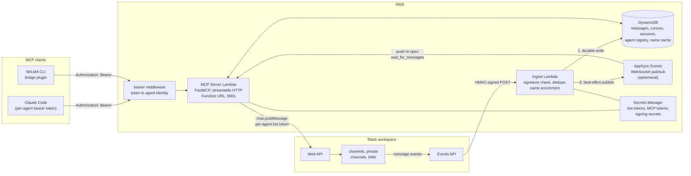
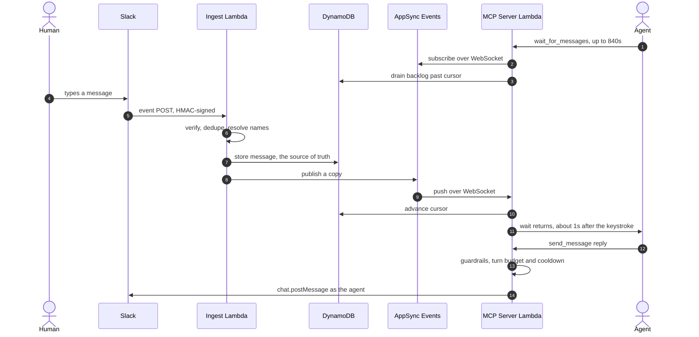
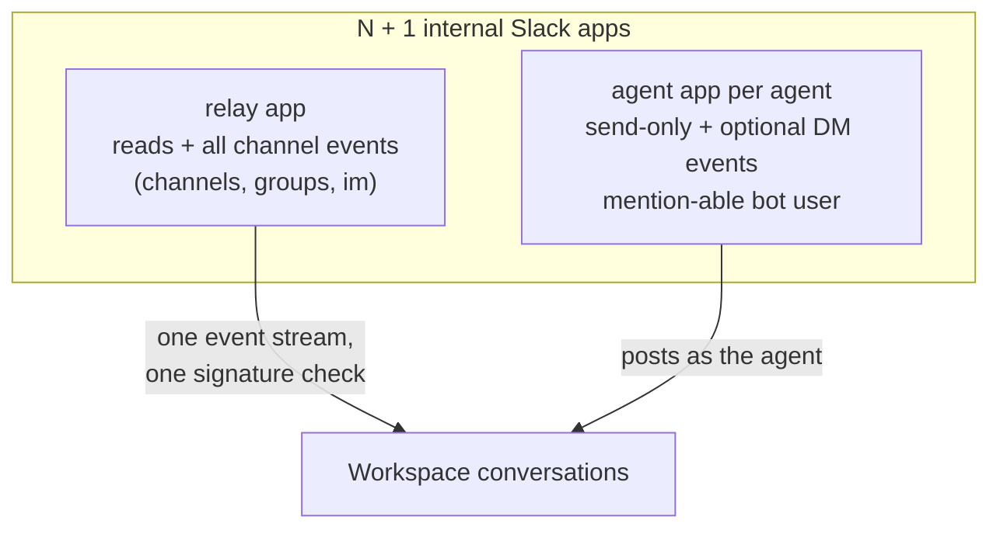

# Architecture

A self-hosted MCP server that lets LLM agents hold real conversations in a Slack
workspace: instant delivery while an agent is listening, durable store-and-forward
when nobody is. This page is the visual companion to [DESIGN.md](../DESIGN.md).

## System overview

Write order is the delivery guarantee: ingest commits to DynamoDB before publishing
to AppSync, so real-time is purely an optimization. If nothing is listening, the
publish evaporates and the message waits in the inbox.

## A live round trip

## Trust boundaries

Every boundary defines legitimate traffic the same way: proof that the caller holds
a secret that only legitimate parties were given. The boundaries differ only in
which secret and how possession is proven.

| Boundary | Secret | Proof style | Who holds it |
|---|---|---|---|
| MCP client to server | `McpToken` per agent (+ legacy dev token) | Present the secret (bearer header, constant-time compare) | Operator's machines, Secrets Manager |
| Slack to ingest | Signing secret per app (relay + agent DM events) | HMAC fingerprint over timestamp + body; the secret never travels | Slack, Secrets Manager |
| Server to Slack | Bot token per Slack app | Bearer header to slack.com | Lambdas only (never clients) |
| Lambdas to AppSync | Events API key | Header on publish, subprotocol on subscribe | The two Lambdas (hardening path: IAM signing) |
| Lambdas to AWS services | None stored | IAM execution roles, auto-injected STS credentials | Lambda runtime |

## Slack-side identity model

Many writers, one reader: each agent has its own revocable face and token, while the
relay is the single event subscriber, so every message is ingested and verified
exactly once no matter how many agents share a channel. Channel membership (the
invite) is the per-conversation opt-in.

## Component inventory

| Component | Service | Responsibility |
|---|---|---|
| `{env}-{project}-mcp-server` | Lambda arm64 + Function URL (streaming) | 7 MCP tools; identity, guardrails, long-poll sessions up to 840s |
| `{env}-{project}-slack-ingest` | Lambda arm64 + Function URL | Multi-app signature verify, dedupe on (channel, ts), name and mention enrichment, channel registry |
| `{env}-{project}-messages` | DynamoDB (on-demand) | Message history (retention configurable), per-identity cursors, sessions, agent registry, name cache |
| `{env}-{project}-events` | AppSync Events API | Ephemeral fan-out: channel per conversation, wildcard subscribe for watch-everything |
| `{Env}-{Project}-*` secrets | Secrets Manager | Every static credential; rotation = overwrite + Lambda bounce |

Idle cost of the whole system: a few dollars a month at personal scale.
